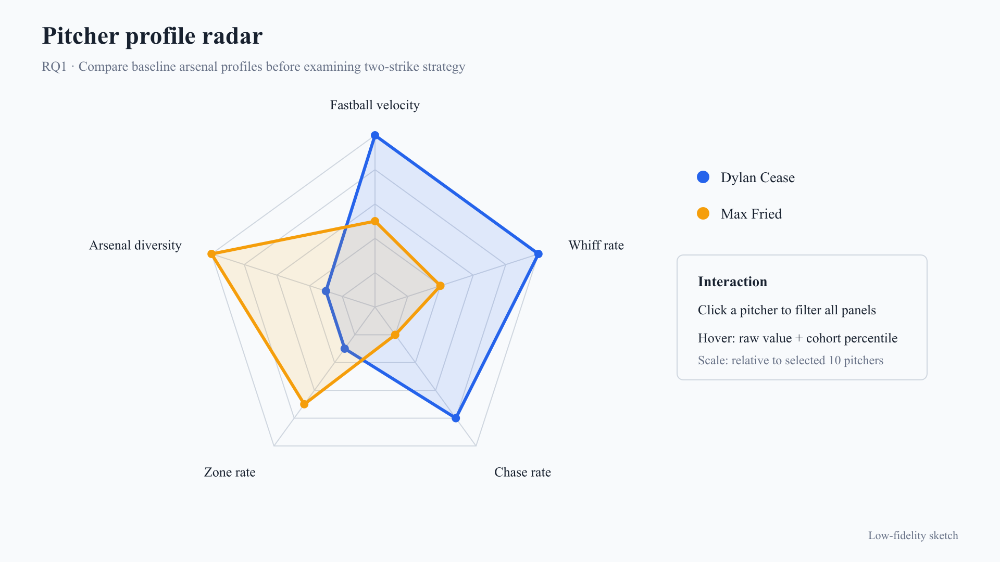
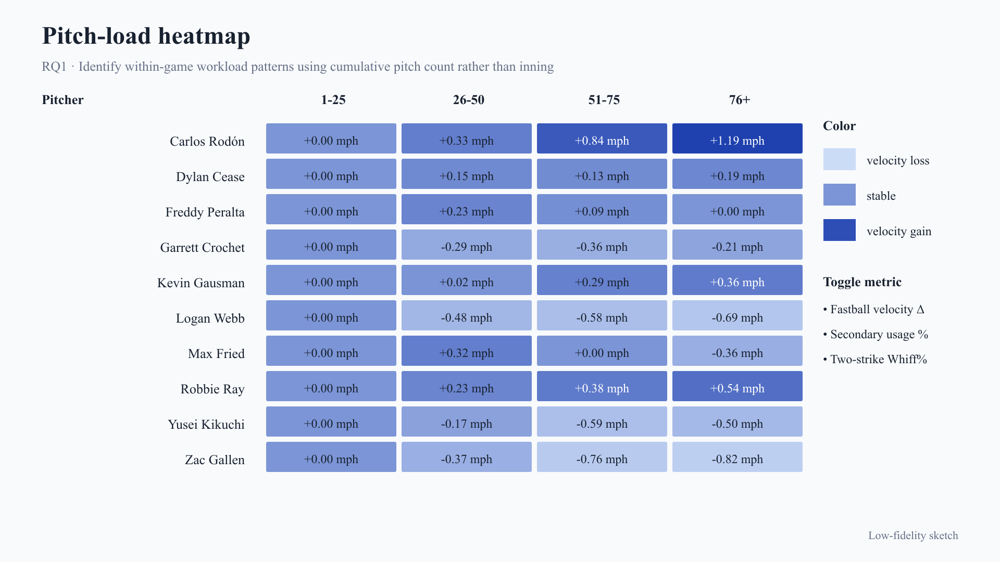
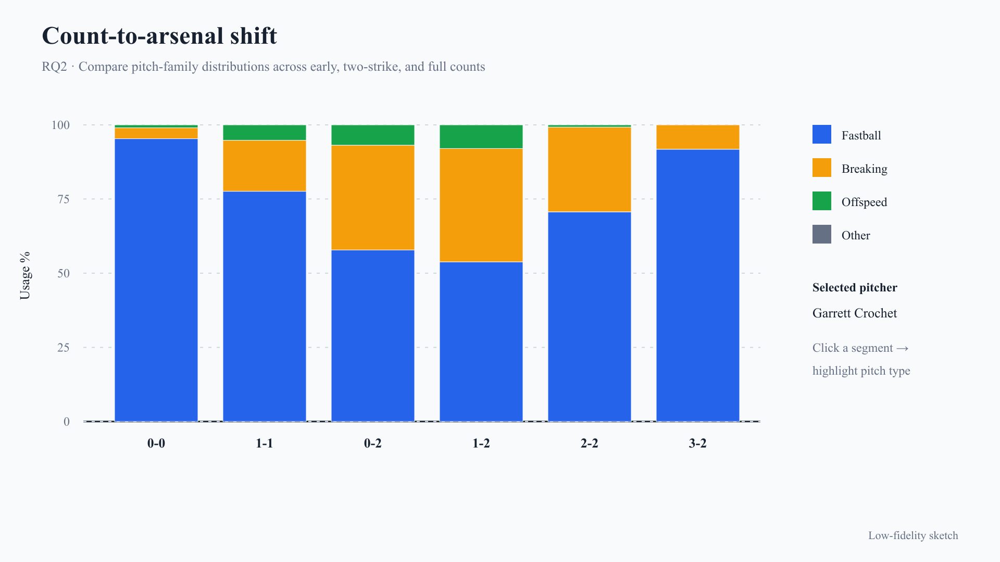
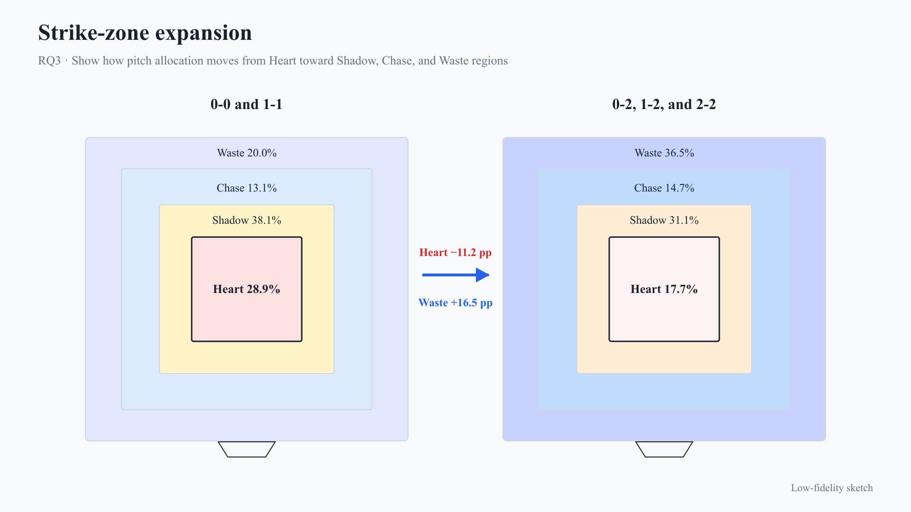
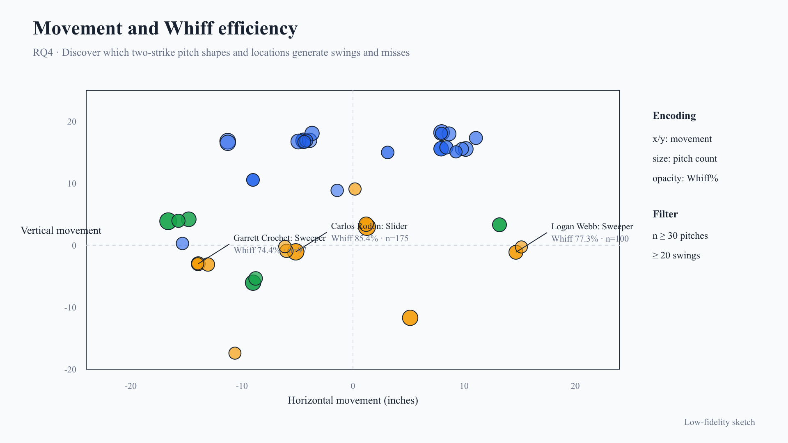
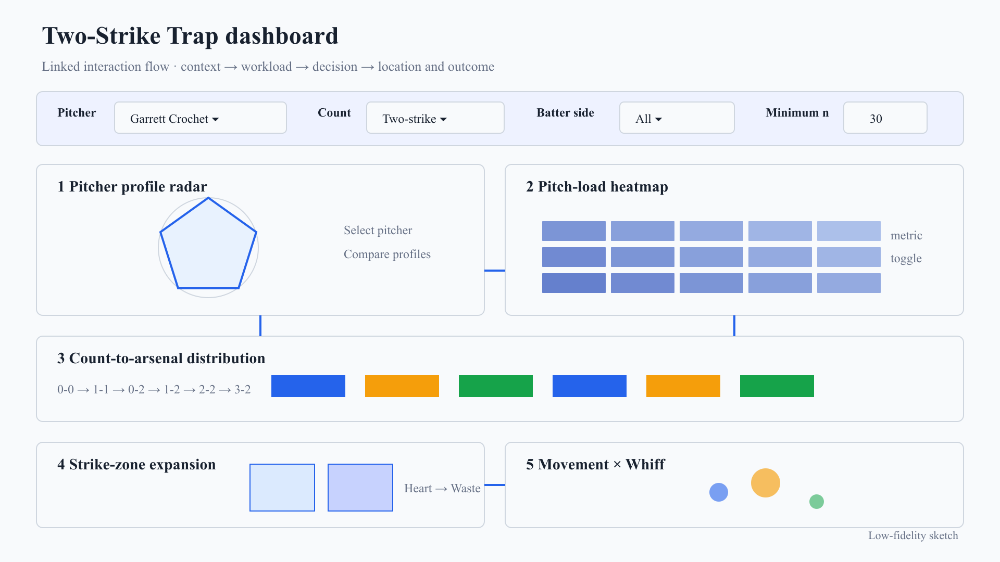

# The Two-Strike Trap: Pitch Selection, Location, and Whiff Strategy Among Elite MLB Starters
## Authors: Kaishen Zhang, Jiaming Cao
## Instructor: Yucheng Jin
## STATS 401

## 1. Topic, Goals, and Questions

A two-strike count looks like a small scoreboard change, but it changes the incentives for both pitcher and hitter. Our project examines how ten high-workload MLB starters changed pitch selection, location, and movement after reaching 0-2, 1-2, or 2-2 in 2025.

Our goal is an interactive dashboard connecting a pitcher's baseline skills with later decisions and outcomes. It is intended for baseball fans, players, coaches, and analysts who know basic pitching terms but not programming. Users can compare pitchers and counts, inspect locations, and identify effective combinations.

The dashboard will address four questions:

1. How do a pitcher's baseline skills and in-game workload limit or change his two-strike choices?
2. How does pitch usage change from early or neutral counts (0-0 and 1-1) to 0-2, 1-2, and 2-2?
3. After reaching two strikes, how far do pitchers move from the center of the strike zone toward the Shadow, Chase, and Waste regions?
4. Which combinations of pitch type, movement, and location produce the highest Whiff% in two-strike situations?

## 2. Datasets

Pitch-level data come from [MLB Baseball Savant Statcast Search](https://baseballsavant.mlb.com/statcast_search), with definitions from its [CSV documentation](https://baseballsavant.mlb.com/csv-docs), and were retrieved through `pybaseball.statcast_pitcher()`. Selection metadata came from the [MLB Stats API](https://statsapi.mlb.com/api/v1/stats). We chose the ten qualified starters with at least 20 starts and the highest official pitch totals.

The cleaned dataset contains 31,253 pitches from 313 games, covering March 27–September 28, 2025. Its 56 original variables became 72 after enrichment. Key attributes include pitch type, velocity, movement, plate location, personalized strike-zone height, count, batter side, swing, and whiff.

Processing combines the raw files, standardizes labels, converts movement to inches, removes duplicate keys, and derives pitch families and outcomes. New fields include count groups, game pitch number, workload bins, previous pitch, batter-normalized location, and distance from the zone edge. Heart, Shadow, Chase, and Waste are project-derived from MLB's attack-zone description. Raw files remain unchanged, and unusual values are flagged rather than silently deleted.

Preliminary EDA provides 11,035 early/neutral pitches and 8,183 primary two-strike pitches. Fastball usage falls from 55.4% to 45.7%, while breaking and offspeed usage rise. Heart share falls from 28.9% to 17.7%; Waste rises from 20.0% to 36.5%.

## 3. Analysis and Visualization Methods

Python, pandas, and pybaseball will support acquisition, cleaning, aggregation, and EDA; D3.js, HTML, and CSS will power the dashboard. Usage% means a pitch type's share within a count, while Whiff% is whiffs divided by swings. Small groups will be de-emphasized, with Wilson confidence intervals shown for Whiff%.

The coordinated views support comparison, filtering, trends, spatial exploration, relationships, and outlier detection. Pitcher, count, batter-side, pitch-type, and sample filters will update related views.

## 4. Visualization Sketches

### Pitcher profile radar

**Technique:** Radar chart. It compares velocity, Whiff%, Chase%, Zone%, and arsenal diversity to establish each pitcher's baseline profile.

### Pitch-load heatmap

**Technique:** Matrix heatmap. It shows whether velocity, secondary-pitch usage, or Whiff% changes from pitches 1-25 through pitches 76+.

### Count-to-arsenal shift

**Technique:** 100% stacked bar chart. It reveals how pitch-family shares change between early, two-strike, and full-count situations.

### Strike-zone expansion

**Technique:** Binned spatial strike-zone map. It shows whether two-strike pitches move away from the Heart toward the zone boundary and beyond.

### Movement and Whiff efficiency

**Technique:** Bubble scatter plot. It connects horizontal and vertical movement with Whiff%, pitch volume, pitch type, and location.

### Linked dashboard layout

**Reference layout:** The wireframe shows how pitcher and count filters connect all five views into one exploration path.

## 5. Group Roles and Responsibilities

**曹佳明 (Cao Jiaming)** will lead acquisition, cleaning, validation, derived variables, and EDA. He will implement the radar chart and workload heatmap.

**张楷绅 (Zhang Kaishen)** will lead interface and interaction design. He will implement the count-to-arsenal, strike-zone, and movement-versus-Whiff views.

Both will refine encodings, review code, test integration, interpret findings, document the project, and present. Cao's additional data work balances Zhang's additional visualization implementation.

## 6. Interim Presentation Deliverables

For the interim presentation, we will show the validated dataset, chart-ready aggregates, preliminary usage/zone/Whiff findings, five revised sketches, and dashboard wireframe. We will demonstrate an initial D3 prototype with a pitcher selector and two connected views: count-to-arsenal and strike-zone. Remaining sample-size and interaction decisions will also be discussed.

## 7. Timeline and Milestones

| Week | Milestone | Tasks | Responsible member(s) | Expected output |
| --- | --- | --- | --- | --- |
| 2 | Project definition | Finalize topic, audience, questions, and pitcher-selection rule | Cao and Zhang | Approved proposal and research scope |
| 3 | Data preparation | Acquire, clean, enrich, validate, and document Statcast data | Cao leads; Zhang reviews | Reproducible dataset, dictionary, and aggregates |
| 4 | Visualization design | Revise five sketches, test encodings, and define linked filters | Zhang leads; Cao reviews | Final design specification and dashboard layout |
| 5 | Interim prototype | Implement count and zone views; present EDA and interaction flow | Cao and Zhang | Working two-view D3 prototype and interim presentation |
| 6 | Implementation and refinement | Build remaining views, tooltips, filters, legends, and sample warnings | Cao: radar/heatmap; Zhang: scatter and integration | Feature-complete dashboard |
| 7 | Final integration | Conduct usability testing, fix defects, refine narrative, and rehearse | Cao and Zhang | Tested website, documentation, and final presentation |
